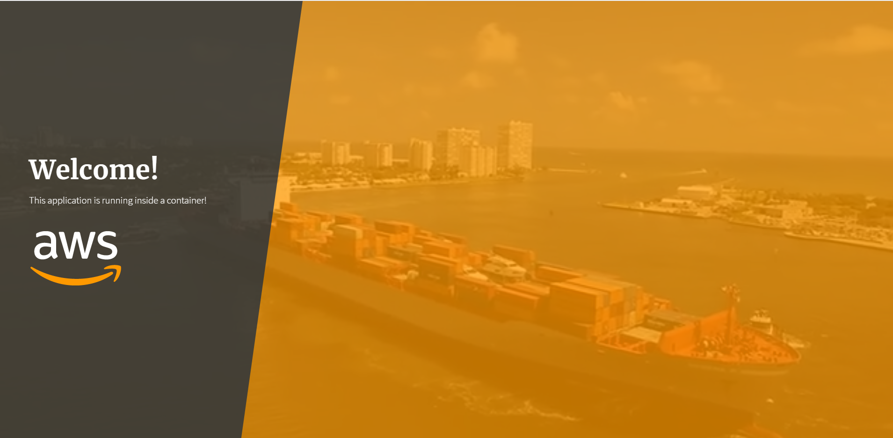

# Criando uma imagem Docker

## 1. Tutorial overview

Esse tutorial irá guiá-lo pelo processo de criar uma imagem Docker, executá-la localmente e publicá-la no repositório de imagem.

Nesse tutorial assumiremos que você completou os passos para configurar o ambiente e possui os seguintes recursos já funcionado:

- Uma conta AWS.
- Cliente Git instalado.
- Docker Engine instalado.
- AWS CLI instalado e configurado.

Para checar se o cliente Git está instalado:

```
$ git --version
```

A saída será algo como:

```
$ git --version
git version 2.16.0.windows.2
```

Para checar se o Docker está instalado:

```
$ docker -v
```

A saída será algo como:

```
$ docker -v
Docker version 19.03.8, build afacb8b
```

Para checar se o AWS CLI está instalado:

```
$ aws --version
```

A saída será algo como:

```
$ aws --version
aws-cli/1.16.85 Python/3.6.0 Windows/10 botocore/1.12.75
```

> Lembre-se que para esse tutorial é recomendado ter instaldo a versão mais recente do AWS CLI.

Para checar o usuário configurado no AWS CLI:

```
$ aws iam get-user --output json
```

A saída será algo como:

```json
$ aws iam get-user --output json
{
    "User": {
        "Path": "/",
        "UserName": "dev.awscli",
        "UserId": "AWS_ACCESS_KEY_ID",
        "Arn": "arn:aws:iam::<account-id>:user/dev.awscli",
        "CreateDate": "2019-01-09T13:25:14Z",
        "Tags": [
            {
                "Key": "Name",
                "Value": "AwsCli"
            }
        ]
    }
}
```

> Para esse comando ser bem sucedido, as credências configuradas no AWS CLI devem ter permissão de leitura no AWS IAM.

## 2. Criando sua primeira imagem

Se você ainda não clonou o repositório do workshop, faça isso agora com o seguinte comando:

```
$ git clone https://github.com/vinicius-lima/aws-hands-on-docker-ecs-git.git
```

Agora iremos criar e testar nosso container localmente.
Nesse passo, construiremos uma imagem Docker de uma aplicação web simples.
A aplicação de usaremos está disponível no diretório `Application` na pasta do projeto.
Assim, vamos navegar até o diretório `Application`:

Linux/Mac:

```
$ cd aws-hands-on-docker-ecs-git/Application/
```

Windows:

```
$ cd aws-hands-on-docker-ecs-git\Application\
```

Você verá que há um diretório chamado `app/` e um arquivo chamado `Dockerfile`.
Usaremos o `Dockerfile` para empacotar nossa aplicação.
Para fazer isso, execute o seguinte comando dentro do diretório `Application`:

```
$ docker build -t containers-workshop-app .
```

Se a criação da imagem foi bem sucedida, a saída deve terminar com algo parecido como:

```
Successfully built 1435477ee40b
Successfully tagged containers-workshop-app:latest
```

> Caso esteja executando no Windows, talvez você se depare com aviso `SECURITY WARNING: You are building a Docker image from Windows against a non-Windows Docker host.` Isso não será um problema para nosso workshop.

Para executar o container:

```
$ docker run -d -p 8080:80 containers-workshop-app
```

Para checar se o container está rodando:

```
$ docker ps
```

O comando deve retornar ao similar a:

```
CONTAINER ID        IMAGE                     COMMAND          CREATED             STATUS              PORTS                  NAMES
931933f33c37        containers-workshop-app   "node server.js"    50 seconds ago      Up 49 seconds       0.0.0.0:8080->80/tcp   stupefied_borg
```

Para testar a aplicação, abra um navegador e digite o endereço [localhost:8080](http://localhost:8080).

Se tudo deu certo, você deve ver sua aplicação web:


