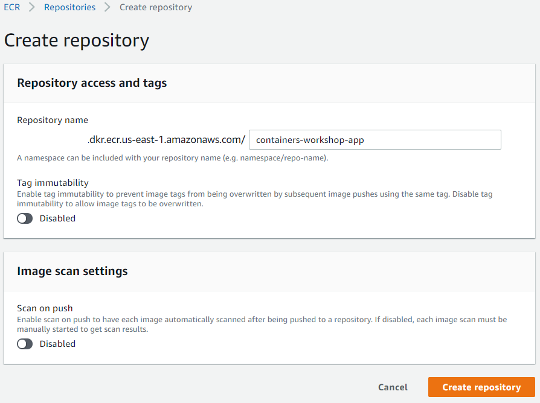
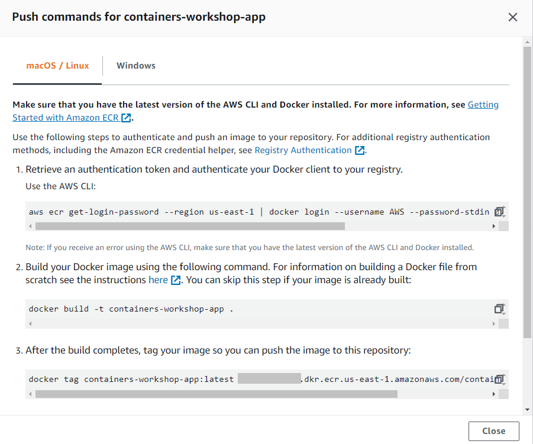

# Criando uma imagem Docker

## 1. Tutorial overview

Esse tutorial irá guiá-lo pelo processo de criar uma imagem Docker, executá-la localmente e publicá-la no repositório de imagem.

Nesse tutorial assumiremos que você completou os passos para configurar o ambiente e possui os seguintes recursos já funcionado:

- Uma conta AWS.
- Cliente Git instalado.
- Docker Engine instalado.
- AWS CLI instalado e configurado.

Para checar se o cliente Git está instalado:

```
$ git --version
```

A saída será algo como:

```
$ git --version
git version 2.16.0.windows.2
```

Para checar se o Docker está instalado:

```
$ docker -v
```

A saída será algo como:

```
$ docker -v
Docker version 19.03.8, build afacb8b
```

Para checar se o AWS CLI está instalado:

```
$ aws --version
```

A saída será algo como:

```
$ aws --version
aws-cli/1.16.85 Python/3.6.0 Windows/10 botocore/1.12.75
```

> Lembre-se que para esse tutorial é recomendado ter instaldo a versão mais recente do AWS CLI.

Para checar o usuário configurado no AWS CLI:

```
$ aws iam get-user --output json
```

A saída será algo como:

```json
$ aws iam get-user --output json
{
    "User": {
        "Path": "/",
        "UserName": "dev.awscli",
        "UserId": "AWS_ACCESS_KEY_ID",
        "Arn": "arn:aws:iam::<account-id>:user/dev.awscli",
        "CreateDate": "2019-01-09T13:25:14Z",
        "Tags": [
            {
                "Key": "Name",
                "Value": "AwsCli"
            }
        ]
    }
}
```

> Para esse comando ser bem sucedido, as credênciais configuradas no AWS CLI devem ter permissão de leitura no AWS IAM.

## 2. Criando sua primeira imagem

Se você ainda não clonou o repositório do workshop, faça isso agora com o seguinte comando:

```
$ git clone https://github.com/vinicius-lima/aws-hands-on-docker-ecs-git.git
```

Agora iremos criar e testar nosso container localmente.
Nesse passo, construiremos uma imagem Docker de uma aplicação web simples.
A aplicação que usaremos está disponível no diretório `Application` na pasta do projeto.
Assim, vamos navegar até o diretório `Application`:

Linux/Mac:

```
$ cd aws-hands-on-docker-ecs-git/Application/
```

Windows:

```
$ cd aws-hands-on-docker-ecs-git\Application\
```

Você verá que há um diretório chamado `app/` e um arquivo chamado `Dockerfile`.
Usaremos o `Dockerfile` para empacotar nossa aplicação.
Para fazer isso, execute o seguinte comando dentro do diretório `Application`:

```
$ docker build -t containers-workshop-app .
```

Se a criação da imagem foi bem sucedida, a saída deve terminar com algo parecido como:

```
Successfully built 1435477ee40b
Successfully tagged containers-workshop-app:latest
```

> Caso esteja executando no Windows, talvez você se depare com aviso `SECURITY WARNING: You are building a Docker image from Windows against a non-Windows Docker host.` Isso não será um problema para nosso workshop.

Para executar o container:

```
$ docker run -d -p 8080:80 containers-workshop-app
```

Para checar se o container está rodando:

```
$ docker ps
```

O comando deve retornar algo similar a:

```
CONTAINER ID        IMAGE                     COMMAND          CREATED             STATUS              PORTS                  NAMES
931933f33c37        containers-workshop-app   "node server.js"    50 seconds ago      Up 49 seconds       0.0.0.0:8080->80/tcp   stupefied_borg
```

Para testar a aplicação, abra um navegador e digite o endereço [localhost:8080](http://localhost:8080).

Se tudo deu certo, você deve ver sua aplicação web:


## 3. Criando um repositório de imagens com ECR

Antes de podermos enviar (_push_) nossas imagens, precisamos de um repositório como destino desse envio.
Assim, criaremos um com o [AWS ECR](https://aws.amazon.com/ecr/).

Para criar um repositório, navegue até o [console do ECR](https://console.aws.amazon.com/ecr).
Se esta é a primeira vez que acessa o console do ECR, você verá o botão `Get Started`. Clique nele.
Se não, clique no botão `Create repository`.
Nomeie seu repositório **containers-workshop-app**:



Assim que o repositório é criado, você será redirecionado para a tela principal do ECR.
Você verá seu repositório recém criado:


Agora, acesse o repositório criado clicando no seu nome.
Clique no botão `View push commands` no canto superior direito.
Será mostrada a lista de comandos que você precisa para fazer o _push_ de imagens Docker.
Os comandos serão algo como:



## 4. Enviando imagens para o ECR

Agora que já testamos nossas imagens localmente, precisamos colocar uma _tag_ nelas e então enviar para o ECR.
Isso nós permitirá utilizá-las em `Task definitions` que podem ser implantadas em cluster do ECS.

Você precisará dos comandos de _push_ que viu durante a criação do repositório.
Você pode encontrá-los novamente indo devolta o repositório (**Console do ECR** > **Repositories** > Selecione o repositório que deseja ver os comandos > **View push commands**).
Ou pode utilizar a sequência de comandos apresentados nessa seção.

A primeira coisa que precisamos fazer é autenticar nosso cliente Docker junto ao ECR.
Para fazer isso, temos que obter o comando `docker login` com as informações do repositório.
Para isso, execute o seguinte comando:

```
$ aws ecr get-login --no-include-email
```

A saída do comando será o comando `docker login` com as informações necessárias:

```
docker login -u AWS -p eyJwYXlsb2FkIjoiQXowb3lmSVNpa2dCeUF0UCt3UjRyN3JqZ2w0ZVFqbjMwQXBFY2szVkRQRUx6KzRMb3REUHhLTlowYk9ncWZYelhwclhXdW1vWm5GVzJPVi9LSDhaRlVsTUtxaGVPMWU2RzV6Njg2QlAraXVDSklPMXdZVTNpNTBLVkR2dnUyaVZ2SkRZUEdmM3BLR0IvSG9WQWFFZmJJVFRJNkZPODVOQWRvcEpHYnJhYmNGQXYvckVGQ0FLa1pkQ1k1NkNNTmcwNFlOek1lanpKLzQyUjZwMlV2ZjgxUVBaTm1ubWZYZE11VHA0MHQ2OGRJdDBuQi9acXZZVkN6MXVzSlJBVFUwK1A4UlNSOXlyL0N3T3lvQWlkUlFDdDlUc3Z1SHVwZGhOeHNkTHVNc1RRcDZvYS9obzFWVXhiN0RJYmhrcWEwdlVIREhtS2t0OTFpUnFGcFV5aVBhYk80eTVGaXlzOU15NkN5QlIzZlI4U2lOUDlmaW9tb2hvMklYYkdZeHpsYXNKK0FvTGFkU2xhYUFxRkRzeGpPaEJRL1ZlTWlNL2Z3bHhDYytuMUdrK29LT1lsZm5LTS9RdUdNcVdXTkJpN1VxUncyN3p4VjJCR3NPT05NaXVMemlQUlhyWXhucVpxTDh6b2JpN25KQy96UXFsRERqdExPTW9UMGdiSmo1bWloTXVqdm4vWWZYRDVqQnAxWTRSNW5YcCtwQ2Q4Z0NSQKSJFXlKT0hUZUJuM21VZFR0N2EzdmhxNWoyL0RtdFJxYVpPNUpSMm9GWjY5UmJYUUFUSStLMDBVZ1lMMFpZVHcycXorbGVZYlh0YzlxK2FTM3krSm53L2FNZVNiUGtoOWJuU01CZDQvSFcvemcxUElsRlhvOEZpTG1ZakppNEpRcHJIa2czemk0ektOOS9NL3pOaXVXSXp1a3Ezb05QZjMrUndZSmptdy9mbFd3OEJGLzJoejJJVXVhbENkWkYzdldRaUhRNEt3YjBYNVFidXdvZTVZOWwyNEJZcVBMdEh4V0xrUUFuS2NVUkEvVTNVSlpLaEVVZXlMV28vSFBYWmxUSK820WUVMU25hNTVUWTJqa0VCcXBhaTEyQTJyTGwwM0tjUjY1VzNyZU05RUVUMmswTmJhZVNWZmNkQ28rUE95dUxCSHJTS2RIVHozbzNuVzE2SlhtaTdOWlRSMlBjMkFCOEExQTNXN01zaGJGcjRqbUs1a1UySWI2cnRjeWcrU2g2Zm0xYWhpQlRueXJrbzlpZGhGanVWbU1GOHppL29jZ3JBTG80TjExOGlvejZwNkxSWmhdVMmdmUWI5UnFGRkXKSjJRVXdFcHBqWXhtSzRLQ0RwTWF4NVhGM1czT1c1MjM1ejV3emR1ZGxwclg5TWdGbmY2Q3ljdjA2YlFEa25LeVZVK2VOQXZqUkZlWndhZGJKeTZtMzdRYkI4MllNN25VVmREVmhtOXpKV0dEUlNQVWpGSzYrLCJkYXRha2V5IjoiQVFFQkFIaHdtMFlhSVNKZVJ0Sm01bjFHNnVxZWVrWHVvWFhQZTVVRmNlOVJxOC8xNHdBQUFINHdmQVlKS29aSWh2Y05BUWNHb0c4d2JRSUJBREJvQmdrcWhraUc5dzBCQndFd0hnWUpZSVpJQVdVREJBRXVNQkVFREtQbEE5b1VnVUpyY3JkOFFRSUJFSUE3MHJETXcwMFJUc0R4eDBCOEN2NXJTK25waW5iUEw4WG9UeUpubmxnbWhGTFkwcGo3WGg4ZEpxMHlkSXpNWGhYT2xxb2ZFUFU4UVk4UkZkRT0iLCJ2ZXJzaW9uIjoiMiIsInR5cGUiOiJEQVRBX0tFWSIsImV4cGlyYXRpb24iOjE1MjE4ODIxOTZ9 https://XXXXXXXXX.dkr.ecr.us-east-1.amazonaws.com
```

Para logar no ECR, copie essa saída e a execute em um terminal de comando.
O retorno deve ser algo como:

```
WARNING! Using --password via the CLI is insecure. Use --password-stdin.
Login Succeeded
```

> Se você não consegui logar no ECR, revise suas permissões de grupo e usuário no IAM.

Agora, vamos adicionar a _tag_ a nossa imagem local e envia-la para o repositório ECR. Use os seguintes comandos:

```
$ docker tag containers-workshop-app:latest XXXXXXXXX.dkr.ecr.us-east-1.amazonaws.com/containers-workshop-app:latest
$ docker push XXXXXXXXX.dkr.ecr.us-east-1.amazonaws.com/containers-workshop-app:latest
```

> :exclamation: Lembre de substituir `XXXXXXXXX` pelo ID de sua conta AWS. Essa informação é apresentada na sua tela do ECR nos comandos de _push_ da imagem Docker.

Esse passo pode levar alguns minutos.
Quando finalizado, você deve ver algo como:

```
The push refers to a repository [XXXXXXXXX.dkr.ecr.us-east-1.amazonaws.com/containers-workshop-app]
4e02160bb335: Pushed
218f9dabbd47: Pushed
f64420a2902a: Pushed
df3749128504: Pushed
5f22987f73bb: Pushed
d57c165262f1: Pushed
a120b7c9a693: Pushed
latest: digest: sha256:293aaf158048c1a52d746047ae411f7f9d2061e5e51ea2fe9875f355f7a9d85a size: 1796
```

Você pode listar suas imagens enviadas para o ECR através do console web ou pelo CLI:

```json
$ aws ecr list-images --repository-name=containers-workshop-app
{
    "imageIds": [
        {
            "imageDigest": "sha256:293aaf158048c1a52d746047ae411f7f9d2061e5e51ea2fe9875f355f7a9d85a",
            "imageTag": "latest"
        }
    ]
}
```

## Próxima etapa

Agora com a imagem armazenada no ECR, crie um serviço no Amazon ECS com essa imagem.
O passo a passo pode ser encontrdo em [Criando um cluster ECS](/DeployEcsCluster).
