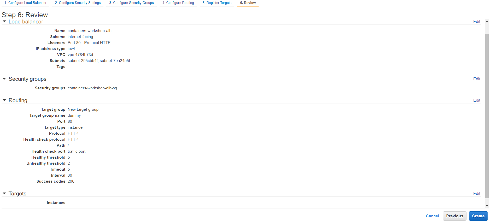
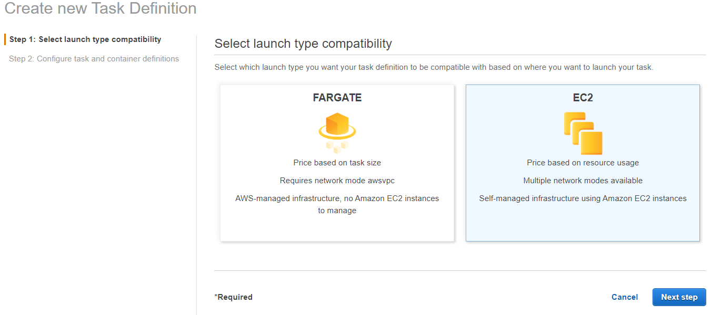
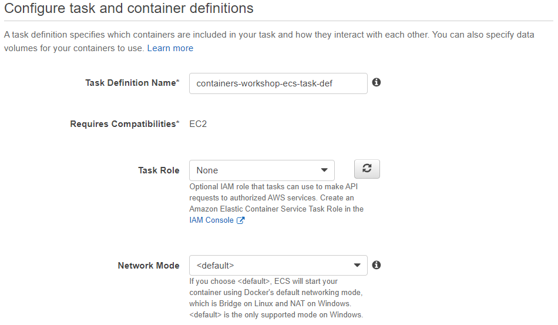
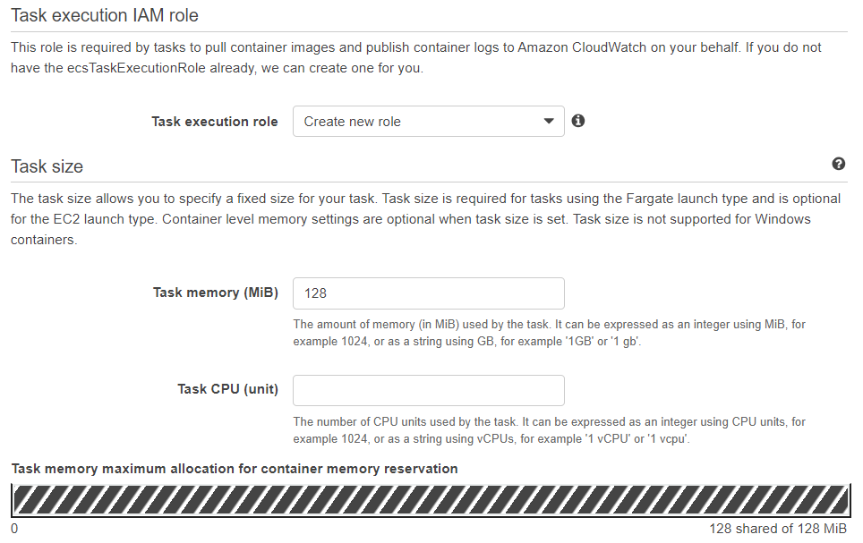
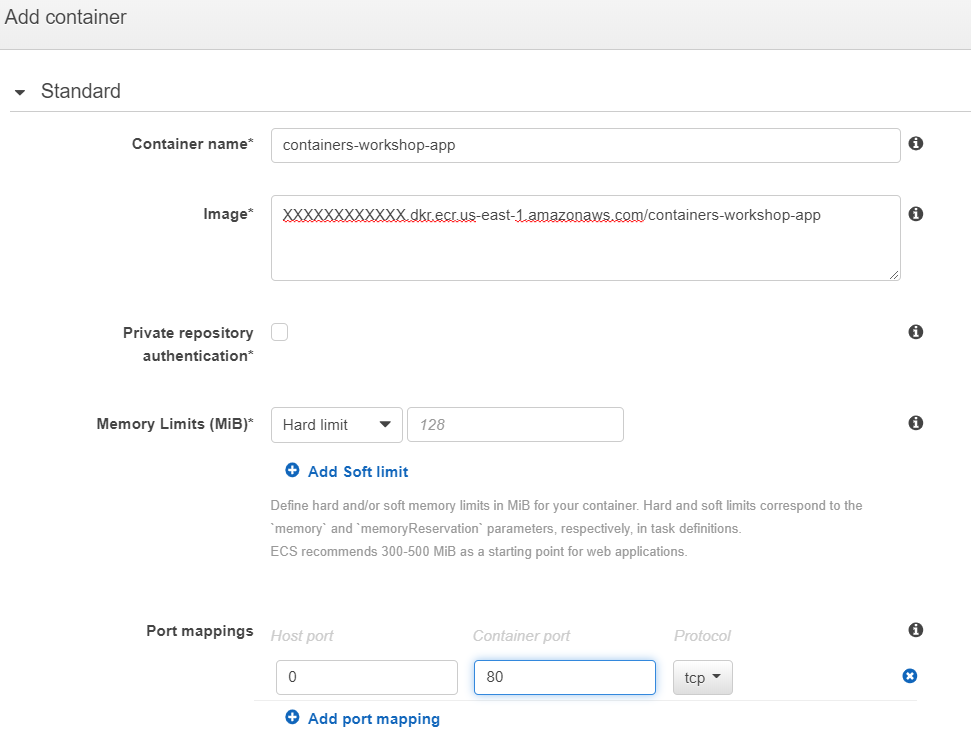

# Criando um cluster ECS

## 1. Tutorial overview

Este tutorial o guiará pela criação de um cluster ECS e a criação de um container com a aplicação criada no tutorial anterior.
Para realizar este tutorial, você deve ter completado os seguintes passos:

- [Configurando o ambiente](../README.md)
- [Criando uma imagem Docker](../CreatingDockerImage)

## 2. Criando o Cluster

Após entrar em usa conta AWS, navegue até o [Console do ECS](https://console.aws.amazon.com/ecs).
No menu do lado esquerdo, clique em `Clusters`.
Caso seja sua primeira vez usando o ECS, você verá essa tela sem qualquer cluster:

Vamos criar um cluster! Clique no botão `Create Cluster`, selecione o template `EC2 Linux + Networking` e clique em `Next Step`:

A nova tela apresentada requer que você entre com algumas informações para o novo cluster.
Na tela `Configure cluster`, mantenha os valores padrão dos campos, mudando apenas os seguintes:

### Configure cluster

- Cluster name: `containers-workshop-ecs-cluster`

### Instance configuration

- EC2 instance type: `t2.micro`

### Networking

- VPC: Selecione sua VPC default.
- Subnets: Escolha duas subnet, `us-east-1a` e `us-east-1b`.

Note que o wizard irá criar um _security group_ permitindo acesso na porta 80 (TCP).

> Nesse tutorial não abordaremos a criação de uma _Key Pair_ para acesso a instâncias EC2. Caso queira acessar via SSH suas instâncias, você precisará criar uma _Key Pair_ e selecioná-la na opção `Key pair` no momento de criação do cluster. Este [link](https://docs.aws.amazon.com/AWSEC2/latest/UserGuide/ec2-key-pairs.html) mostra como criar uma nova _Key Pair_.

Então clique em **Create** no fim da tela.

Quando o processo de criação acabar, você verá a seguinte tela:

[Launch status]

Clique no botão `View Cluster` para ver seu cluster:

[Cluster screen]

## 3. Criando um ALB

Com o cluster criado, precisaremos de um [Application Load Balancer (ALB)](https://aws.amazon.com/elasticloadbalancing/applicationloadbalancer/) para redirecionar tráfego para os endpoints.
Comparado a um load balancer tradicional, um ALB permite direcionar tráfego entre diferentes endpoints.
No nosso exmplo, usaremos o endpoint `/app`.

Vá para o [console do EC2](https://console.aws.amazon.com/ec2) e selecione `Load Balancers` no menu a esquerda.
Clique em `Create Load Balancer`.
No quadro `Application Load Balancer`, clique em **Create**:

Nomeie o ALB `containers-workshop-alb` e adicione um listener HTTP na porta 80:

Na mesma tela, em `Availability Zones` selecione a VPC default e selecione duas AZs, `us-east-1a` e `us-east-1b`:

Após selecionar as AZs, clique em **Next: Configure Security Settings**

Na próxima tela você deve ver uma mensagem dizendo que seu load balancer não usa nenhum _secure listener_.
Podemos pular essa tela clicando em **Next: Configure Security Groups**.

Vamos criar um _security group_ para ser usado pelo ALB.
Em _Step 3: Configure Secury Groups_, selecione a opção `Create a new security group`.
Mude **Security group name** para `containers-workshop-alb-sg` e crie uma regra permitindo a entrada de qualquer tráfego na porta 80:

Então clique em **Next: Configure Routing**.

Durante a configuração inical, adicionaremos um _target group_ apenas para _health check_ em `/`.
Iremos especificar um endpoint para _health check_ para nosso serviço no ECS no momento de registrá-lo no ALB.
Por agora, mude **Name** para `dummy`:

Clique em **Next: Register Targets** e então em **Next: Review**.
Se os valores informados parecem corretos, clique em **Create**:

Após criar seu ALB, será necessário atualizar as regras no _security group_ para que o ALB possa acessar as instâncias EC2 onde o container irá executar.
Para descobrir qual _security group_ está aplicado as suas instâncias, você pode acessar o console do ECS, selecionar o cluster `containers-workshop-ecs-cluster` e então selecionar a tab _ECS Instances_.
Você verá que possui uma instância rodando.
Clique no ID da instância em **EC2 Instance**:

[ECS Instances]

No _EC2 service dashboard_, serão apresentadas todas as informações sobre a instância.
Nessa tela, clique no nome do _security group_:

[EC2 SG]

Na nova tela, com o _security group_ selecionado, clique na tab **Inbound rules** então em **Edit inbound rules**.
Aqui temos a regra criada anteriormente que permite tráfego na porta 80 de qualquer origem.
Vamos mudar essa regra para permitir qualquer tráfego vindo apenas do _security group_ do ALB para nossa instância EC2.
Começe mudando `Type` para `All traffic` e no campo `Source` começe a digitar `sg-`.
Você verá uma lista com todos os _security groups_ criados na conta AWS.
Selecione o _security group_ `containers-workshop-alb-sg` e clique em **Save rules**:

[Editing SG]

Após as mudanças, o _security group_ da sua instância deve ser similar a isso:

[SG after changes]

Nesse ponto, suas instâncias EC2 receberão tráfego do seu ALB.

> NOTA: Criamos uma regra que permite todo o tráfego a partir do ALB porque iremos trabalhar com mapeamento dinâmico de portas no ECS. O mapeamento dinâmico é necessário para rodar mais de um container com a mesma imagem em uma mesma instância EC2. Assim, quando iniciamos uma task, não definimos uma porta, ECS faz isso. Já que não sabemos qual porta será exposta pelo Docker daemon, precisamos permitir todo o tráfego para que nossa aplicação seja acessível pelo ALB.

## 4. Criando uma Task Definition

Quando trabalhamos com ECS para rodar nossas aplicações, há alguns conceitos que precisamos entender.
O primeiro é sobre o que é uma `Task`.
Basicamente, uma _task_ é um subconjunto de containers que precisamos executar para que nossa aplicação funcione.
As `Tasks` são definidas em uma configuração chamada `Task Definition`.

Uma `Task Definition` é onde você especifica sua _task_.
Informações como versão da imagem Docker, quantidade de CPU e memória que cada container irá consumir, quais portas devem ser mapeadas, volumes, variáveis de ambiente, entre outras informações que são especificadas na _Task Definition_.

A primeira informação necessária é a imagem Docker que queremos utilizar.
Nesse caso, iremos usar a imagem criada no [tutorial anterior](../CreatingDockerImage).

Para pegar a imagem, vá até a [página do ECR](https://console.aws.amazon.com/ecr) e clique em `Repositories`.
Você verá o repositório chamado `containers-workshop-app` e a `URI do repositório`.
Anote a URI:

Para criar uma _Task Definition_, na [página do ECS](https://console.aws.amazon.com/ecs) clique em `Task Definitions` no menu a esquerda e então clique em **Create new Task Definition**.
Selecione EC2 como _launch type compatibility_ e clique em **Next step**:

Vamos agora adicionar as informações da nossa _task definition_.
Nomeie sua _task_ `containers-workshop-ecs-task-def` e em **Task Role** selecione `None`:

Em **Task execution IAM role** selecione `Create new role` e em **Task size** digite o valor `128` para o campo **Task memory (MiB)**:

> NOTA: Se esse não é seu primeiro cluster ECS, provavelmente você já tem criada uma IAM Role. Nesse caso, você deve escolher essa IAM Role criada anteriormente. O nome dela geralmete é _ecsTaskExecutionRole_.

O próximo passo é adicionar informação sobre o container.
Em **Container Definitions**, clique no botão **Add container**.
O nome do container será `containers-workshop-app`.
No campo **Image**, adicione a URI do repositório que anotou anteriormente, apontando para sua imagem.

Em **Port mappings** coloque `0` em _Host port_ e `80` em _Container port_:

Algumas coisas a citar:

- Nós inserimos informações sobre uma imagem específica para o container, incluindo a tag `:latest`. Apesar de não ser importante para esse tutorial, em ambientes de produção onde _Task Definitions_ são criadas programaticamente por pipelines de CI/CD, _Task Definitions_ podem incluir um SHA específico ou uma tag mais precisa.

- Em **Port Mappings**, especificamos uma **Container Port** (80), mas deixamos **Host Port** com o valor 0. Isso é intencionamente utilizado para facilitar alocação dinâmica de portas. Significa que não precisamos mapear a porta do container para uma porta específica do host. O ALB dinamicamente alocará uma porta durante a implantação da _task_. Mais informações na [documentação do ECS](http://docs.aws.amazon.com/AmazonECS/latest/APIReference/API_PortMapping.html).

Após especificar o mapeamento de portas, role abaixo para adicionar um driver de log em **STORAGE AND LOGGING**.
Há várias opções, mas para esse tutorial selecione **Auto-configure CloudWatch Logs**:

Assim que inserir um driver de log, clique em **Add** e finalmente clique em **Create** no final da tela.

## 5. Criando o Serviço

Agora que temos na `Task Definition` a descrição de tudo que é necessário para executar nossa aplicação, o próximo passo é rodar o container usando o Amazon ECS.
Faremos isso criando um serviço (`Service`).

No ECS, `Service` permite você executar e manter um número específico (_desired count_) de instâncias de uma `Task Definition` simultaneamente em um cluster ECS.
Se alguma de suas _tasks_ parar ou falhar por qualquer razão, o Amazon ECS lança outra instância da _task_ para substituir e manter o número de _tasks_ em serviço.
Mais informações sobre _ECS Services_ na [documentação do ECS](https://docs.aws.amazon.com/AmazonECS/latest/developerguide/ecs_services.html).

Volte a [tela de clusters](https://console.aws.amazon.com/ecs/) no console do ECS e clique no nome do cluster `containers-workshop-ecs-cluster`.

Na página de detalhes do cluster, clique em **Create** na tab `Services`:

[Details page]

Selecione `EC2` como `Launch type` e escolha a _Task Definition_ criada na seção anterior.
Para o tutorial iremos executar apenas uma instância da _task_.

> Em ambientes de produção, o recomendado é executar mais de uma instância da _task_ para confiabilidade e disponibilidade.

Nomeie seu serviço `containers-workshop-ecs-service`.
Mantenha o valor padrão **AZ Balanced Spread** para _Task Placement Policy_. Para saber mais sobre os diferentes tipos de polícas para implantação de _tasks_, veja a [documentação](http://docs.aws.amazon.com/AmazonECS/latest/developerguide/task-placement-strategies.html) ou esse [blog post](https://aws.amazon.com/blogs/compute/introducing-amazon-ecs-task-placement-policies/).

[Service Name]

Clique em **Next**

Em **Service discovery (optional)** desmarque **Enable service discovery integration**.

Em `Load balancing`, selecione `Application Load Balancer`.
Vamos configurar a integração entre o serviço do ECS e o ALB, assim poderemos acessar nossa aplicação através do ALB.
Selecione `Create new role` em **Service IAM role** e selecione o container `containers-workshop-app:0:80` em **Container to load balance**. Clique em `Add to load balancer`:

[ALB configuration]

Quando criamos nosso ALB, adicionamos um listener para HTTP:80.
Selecione esse valor no _dropdown menu_ como para **Listener**.
Para **Target group name**, entre com o valor `containers-workshop-ecs-target`.
Para **Path Pattern**, o valor deve ser `/*`.
Em **Eveluation order**, coloque o valor `1`.
Para encerrar, em **Health check path** use `/`.

[ALB configuration 2]

Se os valores parecem corretos, clique em **Next Step**.

Não usaremos _Auto Scaling_ nesse tutorial, assim, em `Set Auto Scaling`, clique em **Next Step** e após revisar as configurações, clique em **Create Service**.

## 6. Testando o serviço

Você pode visualizar os eventos do serviço no console do ECS.
Podemos checar se o serviço foi implantado e registrado apropriadamente com o ALB olhando a tab **Events**:

[Events tab]

Podemos testar o ALB em sí.
Para encontrar o registro DNS A do nosso ALB, vá no console do EC2 > **Load balancers** > **Selecione seu Load Balancer**.
Em **Description**, encontramos detalhes sobre o ALB, incluindo uma seção para **DNS Name**.
Entre esse valor em um navegador.

[Testing ALB]

Note que o ALB roteia tráfego apropriadamente baseando-se no _path_ (`/`) que especificamos ao registrar o container.

## Próxima etapa

Após fazer todos os testes que desejar com a infraestrutura criada nesse tutorial, não se esqueça de deletar os recursos criados para evitar cobranças futuras ou o esgotamento de seus limites do _free tier_.
