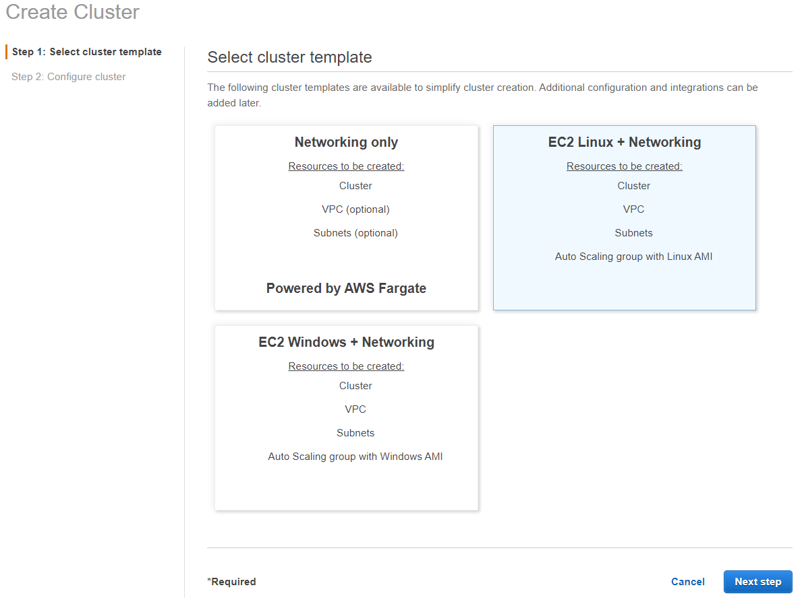
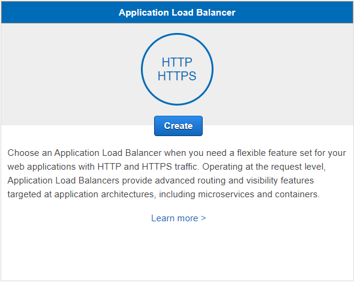

# Criando um cluster ECS

## 1. Tutorial overview

Este tutorial o guiará pela criação de um cluster ECS e a criação de um container com a aplicação criada no tutorial anterior.
Para realizar este tutorial, você deve ter completado os seguintes passos:

- [Configurando o ambiente](../README.md)
- [Criando uma imagem Docker](../CreatingDockerImage)

## 2. Criando o Cluster

Após entrar em usa conta AWS, navegue até o [Console do ECS](https://console.aws.amazon.com/ecs).
No menu do lado esquerdo, clique em `Clusters`.
Caso seja sua primeira vez usando o ECS, você verá essa tela sem qualquer cluster:

Vamos criar um cluster! Clique no botão `Create Cluster`, selecione o template `EC2 Linux + Networking` e clique em `Next Step`:

A nova tela apresentada requer que você entre com algumas informações para o novo cluster.
Na tela `Configure cluster`, mantenha os valores padrão dos campos, mudando apenas os seguintes:

### Configure cluster

- Cluster name: `containers-workshop-ecs-cluster`

### Instance configuration

- EC2 instance type: `t2.micro`

### Networking

- VPC: Selecione sua VPC default.
- Subnets: Escolha duas subnet, `us-east-1a` e `us-east-1b`.

Note que o wizard irá criar um _security group_ permitindo acesso na porta 80 (TCP).

> Nesse tutorial não abordaremos a criação de uma _Key Pair_ para acesso a instâncias EC2. Caso queira acessar via SSH suas instâncias, você precisará criar uma _Key Pair_ e selecioná-la na opção `Key pair` no momento de criação do cluster. Este [link](https://docs.aws.amazon.com/AWSEC2/latest/UserGuide/ec2-key-pairs.html) mostra como criar uma nova _Key Pair_.

Então clique em **Create** no fim da tela.

Quando o processo de criação acabar, você verá a seguinte tela:

[Launch status]

Clique no botão `View Cluster` para ver seu cluster:

[Cluster screen]

## 3. Criando um ALB

Com o cluster criados, precisaremos de um [Application Load Balancer (ALB)](https://aws.amazon.com/elasticloadbalancing/applicationloadbalancer/) para redirecionar tráfego para os endpoints.
Comparado a um load balancer tradicionar, um ALB permite direcionar tráfego entre diferentes endpoints.
No nosso exmplo, usaremos o endpoint `/app`.

Vá para o [console do EC2](https://console.aws.amazon.com/ec2) e selecione `Load Balancers` no menu a esquerda.
Clique em `Create Load Balancer`.
No quadro `Application Load Balancer`, clique em **Create**:

Nomeie o ALB `containers-workshop-alb` e adicione um listener HTTP na porta 80:

Na mesma tela, em `Availability Zones` selecione a VPC default e selecione duas AZs, `us-east-1a` e `us-east-1b`:

Após selecionar as AZs, clique em **Next: Configure Security Settings**

Na próxima tela você deve ver uma mensagem dizendo que seu load balancer não usa nenhum _secure listener_.
Podemos pular essa tela clicando em **Next: Configure Security Groups**.

Vamos criar um _security group_ para ser usado pelo ALB.
Em _Step 3: Configure Secury Groups_, selecione a opção `Create a new security group`.
Mude **Security group name** para `containers-workshop-alb-sg` e crie uma regra permitindo a entrada de qualquer tráfego na porta 80:

Então clique em **Next: Configure Routing**.

Durante a configuração inical, adcionaremos um _target group_ apenas para _health check_ em `/`.
Iremos especificar um endpoint para _health check_ para nosso serviço no ECS no momento de registrá-lo no ALB.
Por agora, mude **Name** para `dummy`:

Clique em _Next: Register Targets_ e então em _Next: Review_.
Se os valores informados parecem corretos, clique em **Create**:

